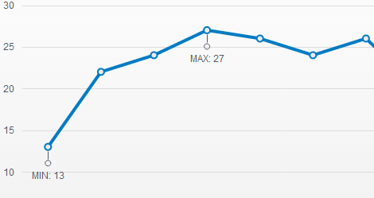

# Notes

The Telerik UI Chart enables you to display the metadata of a point or a specific part of the axis.



## Getting Started

The following example demonstrates how to add a note for each series point.

```
    @(Html.Kendo().Chart()
        .Name("chart")
        .Series(s => s
            .Line(new object[] {
                new {
                    value = 1,
                    noteText = "min"
                },
                new {
                    value = 2,
                },
                new {
                    value = 3,
                    noteText = "max"
                }
            })
            .Field("value")
            .NoteTextField("noteText")
        )
    )
```

## Using Templates

To provide better flexibility, define the content of the notes through a template.

The template provides access to all information that is associated with the point:

* `value`&mdash;The point value. Value dimensions are available as properties, for example, `value.x` and `value.y`.
* `category`&mdash;The category name.
* `series`&mdash;The data series.
* (When binding to a data source) `dataItem`&mdash;The original data item.

```
    @(Html.Kendo().Chart()
            .Name("chart")
            .Series(s => s
                .Line(new object[] {
                    new {
                        value = 1,
                        noteText = "min"
                    },
                    new {
                        value = 2,
                    },
                    new {
                        value = 3,
                        noteText = "max"
                    }
                })
                .Field("value")
                .NoteTextField("noteText")
                .Notes(n => n
                    .Label(l => l
                        .Position(ChartNoteLabelPosition.Outside)
                        .Template("#= dataItem.noteText # of the series")
                ))
            )
    )
```

## See Also

* [Using the API of the Chart HtmlHelper for {{ site.framework }} (Demo)](https://demos.telerik.com/{{ site.platform }}/chart-api/index)
* [Basic Usage of the Area Chart HtmlHelper for {{ site.framework }} (Demos)](https://demos.telerik.com/{{ site.platform }}/area-charts/index)
* [Server-Side API](/api/chart)
