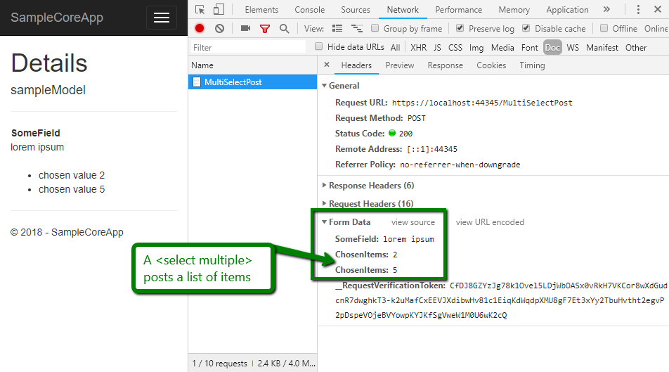

## Environment

<table>
	<tr>
		<td>Product</td>
		<td>MultiSelect for Progress® Telerik® UI for ASP.NET Core, MultiSelect for Progress® Telerik® UI for ASP.NET MVC</td>
	</tr>
</table>

## Description

How can I submit selected data, pass that selected data to the controller action method, and get the values of the MultiSelect on a `submit` post-back to my controller?

## Solution

The MultiSelect is a `<select multiple>` element in the DOM. Therefore, it will POST a list of fields with the values of the selected options. The controller has to expect such an input.

To pass data to a controller in AS.NET Core, use any of the following approaches:

* Use a form and a **Submit** button in the MultiSelect in the same way with a `<select multiple>` element. The suggested approach works best if the HtmlHelper you use is an editor for a model field&mdash;for example, `MultiSelectFor(model => model.TheField)`, which will let you use the model binding to post the entire model from the form. For more information, refer to [this example](https://github.com/telerik/ui-for-aspnet-core-examples/tree/master/multiselect/get-post-data).
* Create your own request where you can read the value of the MultiSelect and pass it as a generic string&mdash;you can get it from its [`value()`](https://docs.telerik.com/kendo-ui/api/javascript/ui/multiselect/methods/value) method. An example of the suggested approach is available in the links from the previous approach.
* Use an AJAX form with additional scripts which basically goes through the inputs on the page and serializes them&mdash;for example,  [https://www.c-sharpcorner.com/UploadFile/0c1bb2/ajax-beginform-in-Asp-Net-mvc-5/](https://www.c-sharpcorner.com/UploadFile/0c1bb2/ajax-beginform-in-Asp-Net-mvc-5/). The suggested approach is similar to the previous idea although you may need to test how these scripts behave with a `<select multiple>` element.
