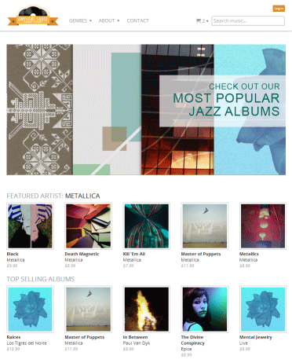
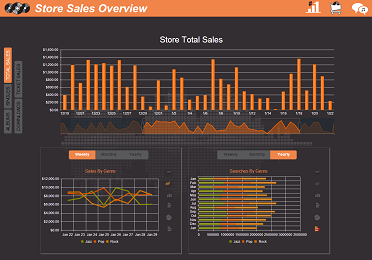

# Kendo UI Music Store Overview

This article is an overview of the Kendo UI Music Store sample project. The Kendo UI Music Store includes two projects: a web application and a dashboard.

## The Web Application

This sample project is based on the [MVC Music Store from Microsoft](https://archive.codeplex.com/?p=mvcmusicstore), so much of the server-side processing and the data structure are reused in this project.

The UI of the Music Store, however, is completely redesigned with Kendo UI. It focuses on [Kendo UI Professional](https://www.telerik.com/kendo-ui), the way it is used and interacts with ASP.NET MVC, WebAPI, and WCF Data Services.

### View the Live Site

To view the live Kendo UI Music Store sample project, refer to [demos.telerik.com/kendo-ui/musicstore](https://demos.telerik.com/kendo-ui/musicstore).

### Get the Source Code

Start by getting the source code for the [Kendo UI Music Store from GitHub](https://www.github.com/telerik/kendo-music-store). The project is for use with Microsoft Visual Studio 2012, and requires MVC 4 and NuGet.

### Explore the Tutorial

Use the navigation tree to your left to navigate through the chapters of this tutorial.

## The Dashboard

The Dashboard builds upon the music store theme, adding a conceptual management dashboard to track the album performance. It focuses on [Kendo UI widgets rendering data visualization](https://www.telerik.com/kendo-ui) and the way Kendo UI and Sammy.js are used to create a visually rich single-page application.

### View the Live Site

The live Kendo UI Music Store Dashboard is located at [demos.telerik.com/kendo-ui/musicstoredashboard](https://demos.telerik.com/kendo-ui/musicstoredashboard).

### Get the Source Code

Start by getting the source code for the [Kendo UI Music Store Dashboard from GitHub](https://www.github.com/telerik/kendo-music-store-dashboard). The project is for use with Microsoft Visual Studio 2012, and requires MVC 4 and NuGet.

### Explore the Tutorial

Use the navigation tree to your left to navigate through the chapters of this tutorial.

## See Also

The other chapters of the tutorial on the Kendo UI Music Store sample project are located at:

* [Build the Kendo UI Music Store Web Application]()
* [Build the Kendo UI Music Store Dashboard]()
