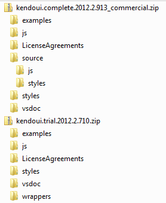
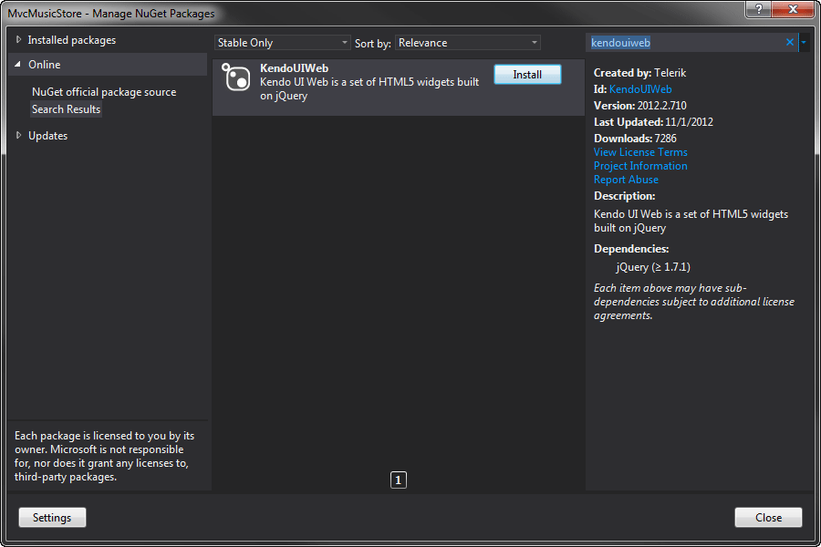

# Set Up the Project

This article demonstrates how to set up the kendo UI Music Store Web Application by using Telerik UI for ASP.NET MVC.

To set up the project, three steps must be applied:

* Add Kendo UI to the project.
* Create the MVC bundles.
* Add Kendo UI  to the ASP.NET layout page.

## Add Kendo UI to Project

Start by adding Kendo UI to the project. The Kendo UI distribution can be downloaded from [telerik.com](https://www.telerik.com/download/kendo-ui-complete), [referenced from the CDN](https://docs.telerik.com/kendo-ui/intro/installation/cdn-service), or fetched with NuGet.

### Download Kendo UI

The preferred method of getting Kendo UI is to browse to [telerik.com](https://www.telerik.com/download/kendo-ui) and download Kendo UI as a `.zip` file. Depending on whether you are using the Trial version or have purchased the full Commercial distribution, you have a `.zip` file that follows one of these directory structures:

The `\js` and `\styles` folders in the root of the `.zip` file contain the minified versions of the Kendo UI `.js` and `.css` files. If you have the commercial version of Kendo UI, you may also notice the `\source` folder. This folder also contains `\js` and `\styles` folders, but these are the full, non-minified versions of the `.js` and `.css`. These are typically used for local development and debugging, but the minified versions are the ones that should be deployed in a real application. For that reason, the examples use the minified files in this project.

### Fetch from CDN

Kendo UI enables you to fetch it from a CDN instead of downloading its files. For more information and the CDN URLs, see [Use Kendo UI CDN Services](https://docs.telerik.com/kendo-ui/intro/installation/cdn-service).

### Fetch from NuGet

Kendo UI is also available using the NuGet package manager in Visual Studio. Search for `kendo`.

### Additional Information

In the Music Store project, the `kendo.all.min.js` file and the `Default` Kendo UI theme are referenced, because the project intends to use the Kendo UI widgets rendering data visualization together with other Kendo UI widgets. If the project was intended to use a few selected portions of Kendo UI, it would have taken individual JavaScript files and make a separate bundle for them, reducing the download size for the end user.

For more information on this topic, refer to the [article on how to get started with Kendo UI](https://docs.telerik.com/kendo-ui/intro/first-steps).

## Create MVC Bundles

ASP.NET MVC 4 is able to bundle and minify JavaScript and Style Sheets. The Music Store project is not bundling the Kendo UI `.js` and `.css` files. This is because it uses `kendo.all.min.js` which is already pre-bundled and minified.

Also, in the `Debug` mode the bundler does not include minified files by default.

The following example demonstrates the making of a bundle from the Kendo UI `.css` files.

    bundles.Add(new StyleBundle("~/Content/kendo").Include(
        "~/Content/kendo.common.min.css",
        "~/Content/kendo.default.min.css"));

These files are going to be included when running in the `Release` mode and not in the `Debug` mode. You are able to see and modify which files the ASP.NET bundler will ignore by inspecting the `bundles.IgnoreList` collection at runtime.

    // Clear all items from the default ignore list to allow minified CSS and JavaScript files to be included in debug mode
    bundles.IgnoreList.Clear();

    // Do not include intellisense files
    bundles.IgnoreList.Ignore("*.intellisense.js");

<!--*-->
### Separate Libs and App Code into Bundles

Most sizeable web applications include a number of `.js` files. It is a good practice to separate these into bundles for third-party libraries and your own application code.

Besides Kendo UI, the only third-party library the Music Store application uses is Date.js. Set a `libs` bundle for this third-party library and an `app` bundle for your own application code.

    bundles.Add(new ScriptBundle("~/bundles/libs").Include(
        "~/Scripts/date.js"));

    bundles.Add(new ScriptBundle("~/bundles/app").Include(
        "~/Scripts/App/kendo-custom-bindings.js",
        "~/Scripts/App/kendo-cart-menu-widget.js",
        "~/Scripts/App/config.js",
        "~/Scripts/App/cart.js",
        "~/Scripts/App/store.js",
        "~/Scripts/App/shared-layout.js"));

Render them in `_Layout.cshtml`.

    @Scripts.Render("~/bundles/libs")
    @Scripts.Render("~/bundles/app")

### Debug with Commercial Versions

While it is a typically good practice to always include the minified versions of `.js` and `.css` files that you use, it makes debugging JavaScript errors more difficult. The commercial version of Kendo UI comes with the full non-minified source code. You can include these files instead, using the ASP.NET bundler to bundle and minify them for production, while still keeping them un-minified for development.

To do this, include the non-minified `.js` and `.css` files from the `\source` folder of the downloaded Kendo UI `.zip` file in your project. Then, configure the ASP.NET bundles to include these files.

    bundles.Add(new ScriptBundle("~/bundles/kendo").Include(
        "~/Scripts/kendo.all.js"));

    bundles.Add(new StyleBundle("~/Content/kendo").Include(
        "~/Content/kendo.common.css",
        "~/Content/kendo.default.css"));

Then set up your `web.config` file to enable bundling only for the `Release` builds of the application. In this way, ASP.NET servers the non-minified files for `Debug`, and a bundled, minified version for `Release`. To do this, set the compilation debug to `true` in the `Debug` version of your `web.config` file.

    <system.web>
      <compilation debug="true" targetFramework="4.5" />

The `Release` version of the `web.config` file set debug to `false`.

    <system.web>
      <compilation debug="false" targetFramework="4.5" />

## Add Kendo UI to Layout Page

You are now able to add Kendo UI and any other third-party libraries to the pages. The Music Store uses the `Views\Shared\_Layout.cshtml` master page, so add Kendo UI here. Make sure that the Kendo UI JavaScript files come after jQuery. For styling, include `kendo.common.min.css`, plus one of the Kendo UI themes.

The following example demonstrates how to use the `kendo.default.min.css` which is the Default theme.

    <head>
        <meta charset="utf-8" />
        <title>@ViewBag.Title - Kendo UI Music Store</title>
        <link href="~/favicon.ico" rel="shortcut icon" type="image/x-icon" />
        <meta name="viewport" content="width=device-width" />
        <link href="~/Content/kendo.common.min.css" rel="stylesheet" /> // <-- Added Here.
        <link href="~/Content/kendo.default.min.css" rel="stylesheet" /> // <-- Added Here.
        @Styles.Render("~/Content/css")
        @Scripts.Render("~/bundles/modernizr")
    </head>
    <body>
        // ...

        @Scripts.Render("~/bundles/jquery")
         // <-- Added Here.
        @RenderSection("scripts", required: false)
    </body>

It is a common practice to include as much JavaScript at the bottom of the `<body>` element as possible. In the Music Store project, you are actually including jQuery in the `<head>`. This aspect is discussed in the tutorial&mdash;however, the reason for it is that on a later stage you are going to use some of [Telerik UI for ASP.NET MVC]() which inserts `<script>` tags into the `<body>` of the page, and requires that jQuery is already defined.

## Handle the Database

The Kendo UI Music Store demo application uses an SQL Server database with sample data for artists, albums, orders, etc.

To populate the sample database, the application uses Entity Framework Code First migrations to create the database and seed the sample data. The migrations are configured to only run in the `Debug` mode. If you run it in the `Release` mode, the code assumes that the database is already created and does not try to create or seed the data.

The connection string configured in the `web.config` file is set to use `LocalDB` and will connect to a local database file in the `App_Data` folder. `LocalDB` requires an SQL Server 2012 or later.

To run the Kendo UI Music Store Dashboard demo, make sure your system meets these requirements or change the connection string to use an SQL Server instance available on your computer.

## See Also

* [Overview of the Kendo UI Music Store Sample Project]()
* [Create the Main Menu]()
* [Create the Home Page]()
* [Create the Genre Page]()
* [Display Album Details]()
* [Create the Search Box]()
* [Implement the Shopping Cart]()
* [Customize the Shopping Cart]()
* [Create the Checkout Page]()
* [Create the Management Grid]()
* [Create the Management Charts]()
